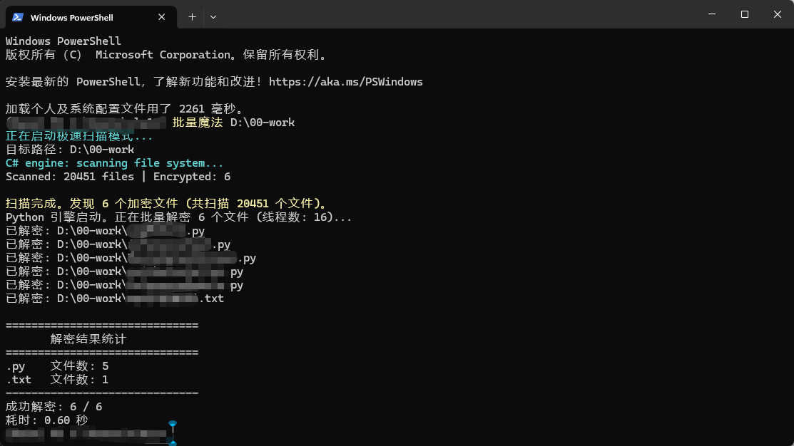

# Fuck_LvDun (批量魔法)

## 简介
这是一个运行在 Windows 平台下的 PowerShell 脚本，旨在解决企业透明加密软件（如绿盾、天锐等）导致的文件无法在非授权环境打开的问题。

本工具通过模拟正常读取（触发透明解密）并使用特殊方式写回文件，从而实现批量解密。

## 使用方法

1.  打开 PowerShell 终端。
2.  运行脚本并指定要扫描/解密的目录或文件路径：

```powershell
.\批量魔法.ps1 "F:\你的\加密\文件夹"
```

或者直接拖拽文件夹到 PowerShell 窗口中作为参数。



## 环境要求
- Windows 10/11
- PowerShell 5.1 或更高版本
- Python 3.x (必须添加到系统环境变量 PATH 中)

## 核心原理
1.  **检测**: 内置 C# 高性能扫描引擎 (`FileCheckerEngineV5`)，通过文件头特征和启发式算法（检查控制字符比例）快速识别被加密的文件。
2.  **解密**: 
    - 利用 Python 读取文件内容。在安装了加密客户端的机器上，读取操作会被驱动拦截并返回明文。
    - 将明文写入临时文件。
    - **关键步骤**: 使用 `cmd.exe /c move` 命令强制覆盖原文件。这种方式通常能绕过加密驱动的“写入即加密”钩子，从而保留文件的明文状态。

## 配置说明
脚本头部包含配置区域，可根据需要自行修改：

- **$TargetExtensions**: 定义需要扫描的文件后缀列表（如 .cpp, .py, .docx 等）。
- **$MaxWorkers**: Python 解密时的并发线程数（默认为 16）。

## 注意事项
- **数据安全**: 虽然脚本经过测试，但涉及文件覆写操作始终存在风险。**请务必先对重要数据进行备份！**
- **环境依赖**: 必须确保当前环境安装了透明加密软件的客户端，并且当前用户有权限读取解密后的内容（即能正常打开文件）。
- **Python环境**: 脚本依赖 Python 进行文件 IO 操作，请确保 `python` 命令在终端可直接调用。

## 免责声明
本工具仅供技术研究和个人数据恢复使用。请勿用于非法用途。使用本工具产生的任何后果由使用者自行承担。
